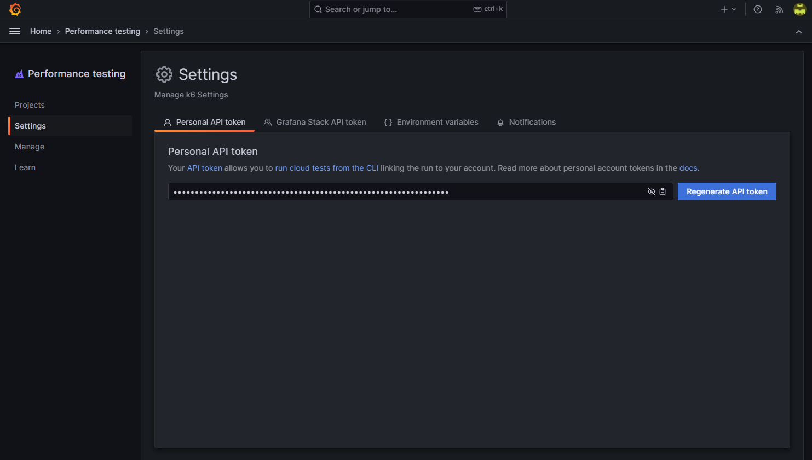

## Breakout 1: Scripting con k6

En este primer breakout te familiarizarás con los conceptos básicos de scripting con k6.

### 1: Creando el script

Para comenzar, abre una terminal y úsala para crear un nuevo archivo llamado `script.js`, luego ábrelo para editarlo.

Nuestro primer ejercicio será crear un script que enviará una solicitud GET al endpoint de recomendaciones. Copia el siguiente código en tu script y asegúrate de reemplazar `<YOUR USERNAME>` en la URL con el nombre de usuario proporcionado en tu correo de bienvenida:

```javascript
import http from 'k6/http'

export const options = {
  vus: 1,
  iterations: 1
}

export default function() {
  http.get('https://<YOUR USERNAME>.work-shop.grafana.net/api/recommendations')
}
```

Analicemos qué contiene el script:

- Hay un `import` inicial del cliente `http` de k6, que se usará para hacer solicitudes HTTP.
- Luego declaramos y exportamos un objeto `options`. Como indica su nombre, este objeto te permite definir una gran variedad de opciones que influyen en cómo se ejecuta el script. En este caso, establecemos las propiedades `vus` e `iterations` en `1`. Esto hará que el código dentro de la `default function` se ejecute una sola vez cuando se ejecute el script.
- Finalmente, declaramos y exportamos una `default function` que contiene el código para hacer la solicitud HTTP GET. Aquí vemos `http.get` usado en su forma más simple, es decir, con un único parámetro que especifica la URL a la que se debe enviar la solicitud GET. Sin embargo, existen variantes ("overloads") de la función que permiten enviar parámetros adicionales, como headers. Veremos algunos ejemplos de eso más adelante.

### 2: Ejecutando el script

Ahora, ¡vamos a ejecutarlo! Guarda el script y luego, usando tu terminal, navega hasta la carpeta donde se encuentra el script. Ejecuta el siguiente comando para correr el script:

```
k6 run script.js
```

NOTA: Si ves un error que indica que tu sistema operativo no reconoce el comando `k6`, significa que el ejecutable de k6 no está en tu PATH. Puedes agregar la ubicación de k6 a tu variable de entorno PATH (recomendado), o incluir la ruta al ejecutable de k6 directamente en el comando.

Una ejecución exitosa del comando debería producir una salida similar a la siguiente:

```
          /\      |‾‾| /‾‾/   /‾‾/
     /\  /  \     |  |/  /   /  /
    /  \/    \    |     (   /   ‾‾\
   /          \   |  |\  \ |  (‾)  |
  / __________ \  |__| \__\ \_____/ .io

  execution: local
     script: script.js
     output: -

  scenarios: (100.00%) 1 scenario, 1 max VUs, 10m30s max duration (incl. graceful stop):
           * default: 1 iterations shared among 1 VUs (maxDuration: 10m0s, gracefulStop: 30s)


     data_received..................: 7.8 kB 32 kB/s
     data_sent......................: 621 B  2.6 kB/s
     http_req_blocked...............: avg=127.55ms min=127.55ms med=127.55ms max=127.55ms p(90)=127.55ms p(95)=127.55ms
     http_req_connecting............: avg=15.62ms  min=15.62ms  med=15.62ms  max=15.62ms  p(90)=15.62ms  p(95)=15.62ms
     http_req_duration..............: avg=115.28ms min=115.28ms med=115.28ms max=115.28ms p(90)=115.28ms p(95)=115.28ms
       { expected_response:true }...: avg=115.28ms min=115.28ms med=115.28ms max=115.28ms p(90)=115.28ms p(95)=115.28ms
     http_req_failed................: 0.00%  ✓ 0        ✗ 1
     http_req_receiving.............: avg=1.96ms   min=1.96ms   med=1.96ms   max=1.96ms   p(90)=1.96ms   p(95)=1.96ms
     http_req_sending...............: avg=520µs    min=520µs    med=520µs    max=520µs    p(90)=520µs    p(95)=520µs
     http_req_tls_handshaking.......: avg=35.16ms  min=35.16ms  med=35.16ms  max=35.16ms  p(90)=35.16ms  p(95)=35.16ms
     http_req_waiting...............: avg=112.79ms min=112.79ms med=112.79ms max=112.79ms p(90)=112.79ms p(95)=112.79ms
     http_reqs......................: 1      4.117856/s
     iteration_duration.............: avg=242.31ms min=242.31ms med=242.31ms max=242.31ms p(90)=242.31ms p(95)=242.31ms
     iterations.....................: 1      4.117856/s
```

¡Felicidades, acabas de ejecutar una prueba de k6!

Repasemos algunas cosas que se muestran en la salida de la CLI:

- Debajo del logo de k6, vemos que `execution` fue `local`, lo que indica que este script se ejecutó desde la máquina local. El otro tipo de `execution` que podrías ver aquí es `cloud`, que es lo que ocurriría al usar el comando `k6 cloud script.js` - esto le indica a k6 que suba y ejecute el script en Grafana Cloud en su lugar.
- Vemos una mención a "scenarios", junto con información sobre "max VUs" y "max duration". k6 tiene la capacidad de ejecutar varias pruebas diferentes en paralelo - cada una de estas pruebas diferentes se llamaría un `scenario`. En este caso, no hemos definido explícitamente un `scenario` en nuestro script, por lo que esta sección simplemente nos indica cuáles eran los ajustes del escenario predeterminado implícito. El número máximo de VUs fue `1`, que es lo que esperamos ver. La duración máxima es `10m30s` y representa el tiempo máximo que se le ha dado a k6 para ejecutar la prueba. La parte `10m` es el tiempo predeterminado dado para ejecutar el escenario, y la parte `30s` representa `gracefulStop`, que es el tiempo máximo que tienen los VUs para completar cualquier iteración en curso del script antes de que k6 la interrumpa forzosamente.
- Finalmente, vemos las métricas predeterminadas que produce k6. Muchas de ellas corresponden a distintos tiempos HTTP (`http_req_*`), de las cuales `http_req_duration` es la más útil de observar, ya que representa el tiempo total de extremo a extremo empleado en enviar y recibir solicitudes HTTP. Además de esas, también tenemos:
  - `data sent/received`: La cantidad de tráfico de red generado/recibido por el tráfico HTTP producido por la prueba.
  - `http_reqs`: El número total de solicitudes HTTP enviadas, así como la tasa de solicitudes HTTP por segundo.
  - `iteration_duration`: Cuánto tiempo tomó completar 1 iteración del script (en este caso, corresponde a cuánto tardó en ejecutarse la `default function`).
  - `iterations`: El número total de iteraciones, así como la tasa de iteraciones por segundo.
  - `http_req_failed`: El número de solicitudes HTTP fallidas. Ten en cuenta que 0% significa que no hubo fallos.

Dado que solo ejecutamos 1 iteración y, por lo tanto, hicimos solo 1 solicitud HTTP, los tiempos reportados son todos iguales para los valores mínimo/mediana/máximo/percentil 90/percentil 95. Hagamos algo respecto a eso, ¡y qué mejor manera de hacerlo que ejecutando una prueba de carga real!

### 3: Ejecutando una prueba de carga

Modifica el script existente con estos cambios. Ten en cuenta que si copias y pegas el script completo, deberás reemplazar tu nombre de usuario en la URL nuevamente:

```javascript
import http from 'k6/http'
import { sleep } from 'k6'
import { randomIntBetween } from 'https://jslib.k6.io/k6-utils/1.2.0/index.js';

export const options = {
  vus: 100,
  iterations: 1000
}

export default function() {
  http.get('https://<YOUR USERNAME>.work-shop.grafana.net/api/recommendations')

  sleep(randomIntBetween(1, 5))
}
```

Esto es lo que ha cambiado en este script:

- Tenemos dos declaraciones `import` adicionales, la primera de las cuales es una importación de `sleep`, que es una de las muchas funciones incorporadas disponibles en k6. Su propósito es inducir un retraso artificial cada vez que se llama. Aunque introducir un retraso pueda parecer contraintuitivo cuando queremos generar carga, puede ser bastante útil cuando el propósito de la prueba de carga es que tus Virtual Users representen con mayor precisión a usuarios *reales*, particularmente aquellos que interactúan con las APIs como resultado de navegar por un sitio web: sin ningún tipo de retraso en el script, la actividad generada al ejecutar la prueba se parecería a usuarios que actualizan la página constantemente. En la realidad, los usuarios pasarán algo de tiempo mirando lo que se muestra en la página antes de continuar a la siguiente. Durante ese tiempo, es probable que no haya realmente ninguna actividad HTTP. Por eso a estos retrasos artificiales se les llama "think time" en la jerga de las pruebas de rendimiento.
- La segunda importación nueva es para una función llamada `randomIntBetween`. Ten en cuenta que se está obteniendo desde una URL en lugar de localmente - siempre que el archivo JavaScript referenciado por la URL sea accesible públicamente desde la máquina donde se ejecuta k6, podemos usar las funciones exportadas desde él. Échale un vistazo a https://jslib.k6.io/ para ver qué más hay disponible. Usaremos `randomIntBetween` para agregar algo de aleatoriedad a la función `sleep` añadida en la `default function` después de hacer la solicitud. Esto ayudará a garantizar que nuestros VUs no intenten hacer la solicitud HTTP exactamente al mismo tiempo.
- Finalmente, hemos establecido `vus` en `100` e `iterations` en `1000`. Esto hará que k6 use 100 VUs para realizar exactamente 1000 iteraciones de la `default function`.

Guarda el script y ejecuta la prueba nuevamente con el mismo comando que antes (`k6 run script.js`):

```
          /\      |‾‾| /‾‾/   /‾‾/
     /\  /  \     |  |/  /   /  /
    /  \/    \    |     (   /   ‾‾\
   /          \   |  |\  \ |  (‾)  |
  / __________ \  |__| \__\ \_____/ .io

  execution: local
     script: script.js
     output: -

  scenarios: (100.00%) 1 scenario, 100 max VUs, 10m30s max duration (incl. graceful stop):
           * default: 1000 iterations shared among 100 VUs (maxDuration: 10m0s, gracefulStop: 30s)


     data_received..................: 3.2 MB 83 kB/s
     data_sent......................: 130 kB 3.4 kB/s
     http_req_blocked...............: avg=16.21ms  min=0s      med=0s       max=177.3ms p(90)=12.28ms p(95)=166.04ms
     http_req_connecting............: avg=4.64ms   min=0s      med=0s       max=61.29ms p(90)=3.79ms  p(95)=45.82ms
     http_req_duration..............: avg=479.1ms  min=77.6ms  med=140.84ms max=4.43s   p(90)=1.13s   p(95)=3.23s
       { expected_response:true }...: avg=450.24ms min=77.6ms  med=139.61ms max=4.43s   p(90)=419.1ms p(95)=3.27s
     http_req_failed................: 1.40%  ✓ 14        ✗ 986
     http_req_receiving.............: avg=1.81ms   min=0s      med=1.78ms   max=9.94ms  p(90)=2.67ms  p(95)=3.26ms
     http_req_sending...............: avg=39.67µs  min=0s      med=0s       max=1ms     p(90)=0s      p(95)=509.68µs
     http_req_tls_handshaking.......: avg=5.71ms   min=0s      med=0s       max=70.55ms p(90)=2.6ms   p(95)=57.26ms
     http_req_waiting...............: avg=477.25ms min=76.14ms med=139.06ms max=4.43s   p(90)=1.13s   p(95)=3.23s
     http_reqs......................: 1000   25.861591/s
     iteration_duration.............: avg=3.58s    min=1.08s   med=3.35s    max=9.61s   p(90)=5.26s   p(95)=6.02s
     iterations.....................: 1000   25.861591/s
     vus............................: 8      min=8       max=100
     vus_max........................: 100    min=100     max=100
```

Usando estas métricas, ¡ahora podemos empezar a hacer observaciones interesantes sobre el rendimiento! Por supuesto, tus propios resultados probablemente serán bastante diferentes a los de arriba, así que ten eso en cuenta al sacar conclusiones.

- Enviar 1000 solicitudes HTTP resultó en un tamaño total de descarga de 3.2 MB.
- El tiempo de respuesta promedio para el envío/recepción de extremo a extremo de la solicitud (`http_req_duration`) fue de 479.1ms. El tiempo de respuesta mínimo registrado fue de 77.6ms, así que hay una diferencia bastante considerable. El tiempo de respuesta más alto reportado fue de 4.43s, pero el 95% de los tiempos de respuesta estuvieron por debajo de 3.23s (o, dicho de otro modo, el 5% de los tiempos de respuesta estuvieron por encima de 3.23s) si observamos el valor `p(95)`.
  - Hay una línea adicional justo debajo de `http_req_duration` que representa un filtro que se ha aplicado a `http_req_duration`, concretamente `{ expected_response:true }`. Los tiempos reportados aquí solo toman en cuenta las solicitudes consideradas exitosas, lo cual es útil si consideras que los fallos pueden sesgar los tiempos en cualquiera de las dos direcciones (los servidores pueden responder con un error instantáneamente, o pueden agotar el tiempo de espera, en cuyo caso los tiempos de respuesta podrían sesgarse hacia arriba).
- 14 de las 1000 solicitudes realizadas - o el 1.4% del total - fallaron.
- La prueba logró alcanzar una tasa de solicitudes HTTP de casi 26/s.

Hubo algunas deficiencias en la última prueba que ejecutamos que deberíamos abordar.

La primera de ellas fue la falta de manejo de errores/registro (logging); tuvimos fallos, pero realmente no sabemos por qué ocurrieron. Podría tener sentido imprimir algo de información en la consola.

El segundo cambio que haremos es aumentar gradualmente el número de VUs a lo largo de un período de tiempo; a pesar de haber agregado un retraso aleatorio en la `default function`, todos los VUs estaban configurados para iniciar al mismo tiempo y todos habrían hecho la primera solicitud HTTP exactamente en el mismo milisegundo. Esto *generalmente* no es un escenario realista, así que démosle al lado del servidor un poco más de oportunidad de reaccionar ante la repentina afluencia de solicitudes.

El tercer cambio es agregar un `Threshold` a la prueba. El Threshold nos permitirá definir qué consideramos como una prueba exitosa. Al final de la ejecución de la prueba, si el threshold falla, el código de salida será distinto de cero y veremos un mensaje que indica que la prueba falló como resultado de haber superado el threshold.

### 4: Agregando manejo de errores, incrementando gradualmente los VUs y agregando un threshold

Aquí está la siguiente versión del script que querremos ejecutar. Nuevamente, asegúrate de reemplazar el nombre de usuario en la URL:

```javascript
import http from 'k6/http'
import { sleep, check } from 'k6'
import { randomIntBetween } from 'https://jslib.k6.io/k6-utils/1.2.0/index.js';

export const options = {
  stages: [
    { duration: '1m', target: 200 },
    { duration: '2m', target: 200 },
  ],
  thresholds: {
    http_req_duration: ['p(95)<2000'], // 95% of requests should be below 2000ms
  }
}

export default function() {
  const response = http.get('https://<YOUR USERNAME>.work-shop.grafana.net/api/recommendations')

  const didSucceed = check(response, {
    'is status 200': (r) => r.status === 200,
  });

  if (!didSucceed) {
    console.log(`Unexpected response code: ${response.status}. Received: ${response.body}`)
  }

  sleep(randomIntBetween(1, 5))
}
```

Lo que hemos hecho:
- En lugar de establecer `vus` e `iterations`, ahora tenemos una propiedad `stages` en `options`, que a su vez se establece en un array de dos objetos que representan cada uno una "etapa" en nuestra prueba. Con `stages`, le estamos indicando a k6 que ejecute una prueba con un número variable de VUs (el `target`) que se ejecutará durante un período de tiempo específico (la `duration`), en lugar de ejecutar un número predeterminado de iteraciones del script. La primera etapa se traduce como "comenzar la prueba con 0 VUs e incrementar linealmente el número de VUs a 200 durante un período de 1 minuto". La segunda etapa se traduce como "mantenerse en 200 VUs durante los siguientes 2 minutos".
- También agregamos una propiedad `thresholds` al objeto `options`, y la configuramos con un objeto que tiene una única propiedad llamada `http_req_duration`, que es una de las métricas incorporadas. Representa el tiempo transcurrido desde que se envía una solicitud hasta que se recibe una respuesta, y la expresión proporcionada se traduce como "el 95% de las solicitudes deben estar por debajo de 2000ms".
- En la `default function`, ahora estamos almacenando la respuesta HTTP en una variable llamada `response`. Luego llamamos a la función `check` recién importada. La usaremos para verificar si recibimos el código de estado esperado - HTTP 200 - y si no es el caso, registraremos el código de estado recibido junto con el cuerpo de la respuesta, que puede o no incluir información adicional de depuración que nos ayude a determinar qué salió mal. `check` nos dará un conteo del número de éxitos y fallos en el resumen final de la prueba.

**¡Todavía no lo ejecutes!** - vamos a cambiar desde dónde ejecutamos esta prueba. En lugar de ejecutarla localmente, vamos a subir el script a Grafana Cloud y ejecutarlo en generadores de carga alojados (hosted load generators).

### 5: Ejecutando la prueba en Grafana Cloud

Antes de poder ejecutar pruebas en Grafana Cloud k6, primero necesitarás autenticar tu k6 local usando un token de API. El token de API se puede encontrar en Grafana Cloud (`https://<YOUR USERNAME>.grafana.net/`).

Dentro del menú de navegación `Performance Testing`, ve a la página `Settings`. Ahí verás una sección llamada `Personal API token`:



Copia este token al portapapeles. Para autenticarte, volveremos a la terminal y pasaremos el token en el siguiente comando:

```
k6 login cloud --token <token>
```

¡Ahora deberías estar autenticado en la Cloud!

Ahora, en lugar de ejecutar la prueba con `k6 run`, usaremos el comando `cloud`:

```
k6 cloud script.js
```

¡Vamos a ejecutarlo y ver qué sucede!

```
          /\      |‾‾| /‾‾/   /‾‾/
     /\  /  \     |  |/  /   /  /
    /  \/    \    |     (   /   ‾‾\
   /          \   |  |\  \ |  (‾)  |
  / __________ \  |__| \__\ \_____/ .io

  execution: cloud
     script: script.js
     output: https://<YOUR USERNAME>.grafana.net/a/k6-app/runs/<testrunid>

  scenarios: (100.00%) 1 scenario, 200 max VUs, 3m30s max duration (incl. graceful stop):
           * default: Up to 200 looping VUs for 3m0s over 2 stages (gracefulRampDown: 30s, gracefulStop: 30s)

INFO[0076] Unexpected response code: 503. Received: upstream connect error or disconnect/reset before headers. reset reason: connection termination  source=console 
INFO[0103] Unexpected response code: 503. Received: upstream connect error or disconnect/reset before headers. reset reason: connection termination  source=console 
INFO[0108] Unexpected response code: 503. Received: upstream connect error or disconnect/reset before headers. reset reason: connection termination  source=console 
INFO[0126] Unexpected response code: 503. Received: upstream connect error or disconnect/reset before headers. reset reason: connection termination  source=console 
INFO[0126] Unexpected response code: 503. Received: upstream connect error or disconnect/reset before headers. reset reason: connection termination  source=console 
INFO[0126] Unexpected response code: 503. Received: upstream connect error or disconnect/reset before headers. reset reason: connection termination  source=console 
INFO[0126] Unexpected response code: 503. Received: upstream connect error or disconnect/reset before headers. reset reason: connection termination  source=console 
[cut for brevity]

Run    [======================================] Finished
```

¿Qué vemos esta vez? Ahora vemos que `execution` está establecido en `cloud`, y se nos proporciona un enlace para hacer clic en `output`. Haz clic en este enlace para acceder a la vista en tiempo real de la prueba en ejecución en Grafana Cloud k6.
  
¡Eso es todo por este breakout! Veremos Grafana Cloud k6 más de cerca en la siguiente presentación.
