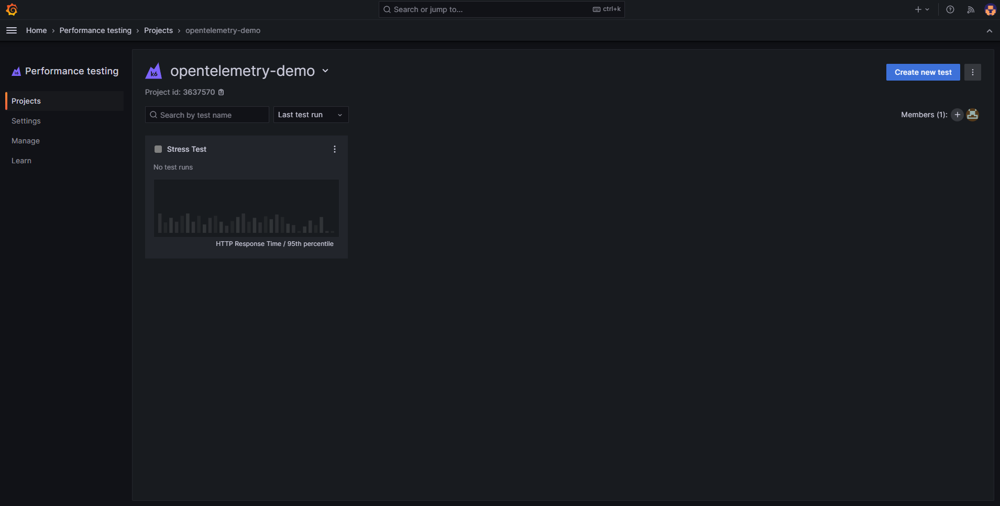
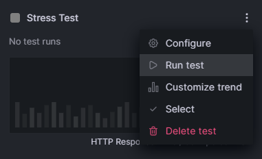
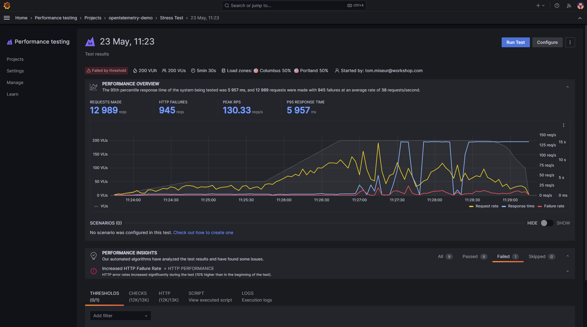
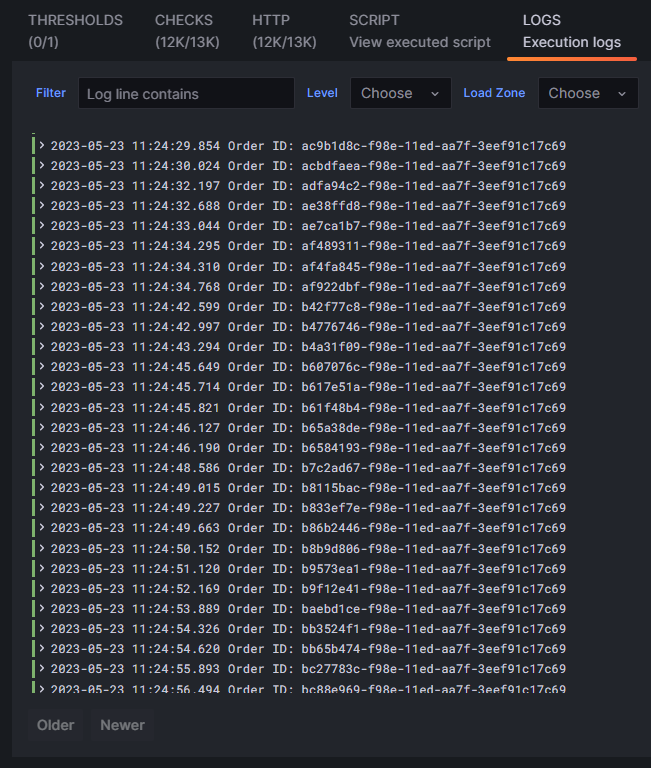
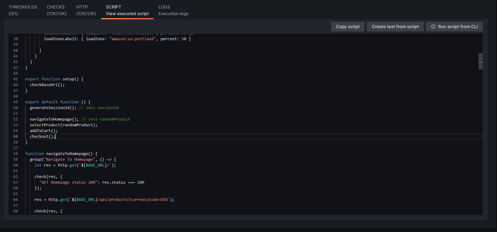
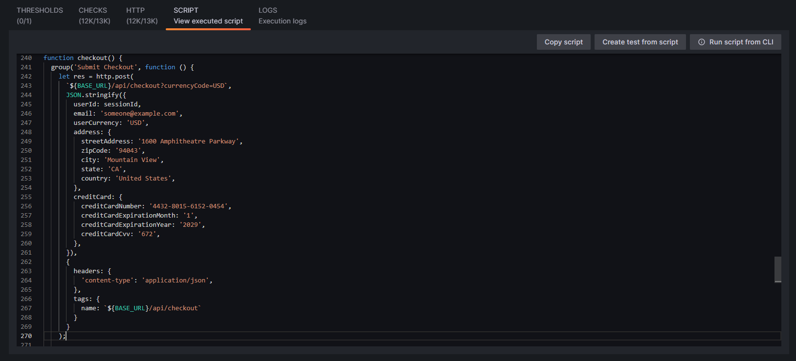
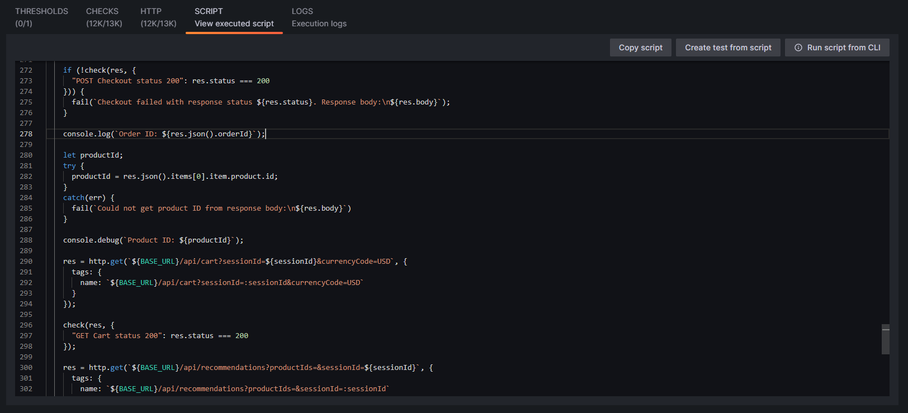

## Breakout 2: Ejecutando pruebas en la nube

En este breakout, ejecutaremos una prueba de k6 preconfigurada disponible en tu stack de Grafana Cloud.

Aunque hemos hecho todo lo posible para asegurarnos de que la app de demostración falle bajo presión, no está garantizado. Esto es un poco la realidad de las pruebas de carga, y es por eso que es importante ejecutar las pruebas varias veces. La prueba solo se ejecuta durante unos minutos, así que deberías poder ejecutar varias pruebas durante el breakout, y esperamos que veas cosas interesantes suceder en al menos una de ellas.

### 1: Ejecutando la prueba

La prueba que estamos buscando se llama `Stress Test`. Se puede encontrar en `Performance Testing` -> `Projects` -> `opentelemetry-demo`:



Haz clic en el "ícono de hamburguesa" y selecciona `Run test` para iniciar la prueba:



Al hacerlo, la UI mostrará la animación de inicio de la prueba, junto con una barra de progreso y actualizaciones de estado. Después de unos 30 segundos, la página te redirigirá a la UI de ejecución de pruebas, donde se puede ver el progreso de la prueba en tiempo real. Una vez que la prueba haya finalizado, la pantalla debería verse algo así:



La prueba tardará unos minutos en completarse, así que aprovechemos este tiempo para explorar la UI de ejecución de pruebas.

### 2: Inspeccionando los logs

Para el momento en que la prueba haya comenzado, ya debería haber algunos logs disponibles para revisar. Para verlos, haz clic en la pestaña `Logs`:



Si la prueba se está ejecutando según lo esperado, los únicos mensajes de log que deberían aparecer aquí son los que imprimen los Order IDs. Estos Order IDs se generan del lado del servidor, por lo que son útiles para verificar que la prueba realmente está creando órdenes según lo esperado.

Lo que podría ser útil hacer ahora es mirar el código del script que está imprimiendo estos logs. Para hacerlo, navega a la pestaña `Script`, luego desplázate hacia abajo hasta que puedas ver la línea 55:



La llamada a función en la línea 55 se llama `checkout` - esa es la que nos interesa.

Se encuentra dentro de la `default function`, que es la función que los VUs ejecutarán repetidamente hasta que termine la prueba. Esta función, a su vez, llama a otras funciones definidas más abajo en el script, una de las cuales es `checkout`. Separar el código en funciones de esta manera tiene dos ventajas: reutilización de código y legibilidad.

La función `checkout` en sí se puede encontrar en la línea 240:



La transacción de checkout - cuando se ejecuta a través del navegador - en realidad consiste en una secuencia de solicitudes HTTP. Podría ser interesante capturar el tiempo que tarda toda la secuencia en completarse - este es el propósito detrás de la función incorporada `group`.

Al inicio de la función `group`, estamos haciendo una solicitud POST con un payload JSON. Establecemos el header `Content-Type` en `application/json`, y también agregamos un `tag` a la solicitud. Este `tag`, con el valor de propiedad `name`, modificará cómo se muestra la solicitud en la pestaña de HTTP, sobrescribiendo la URL con lo que se le pase al tag `name`. En este caso, simplemente estamos recortando la parte de la cadena de consulta (query string) de la URL (es decir, la parte `?currencyCode=USD`). Así es como agruparías solicitudes que van al mismo endpoint pero que pueden tener parámetros levemente diferentes (en este caso no hay ninguno, pero de todas formas se considera una buena práctica etiquetar las solicitudes).

Desplázate un poco más abajo y verás una función `check`, seguida del statement `console.log` que estamos buscando:



El `check` se usa para confirmar si recibimos el código de estado HTTP 200 esperado. Si ese no fuera el caso, se llamará a la función incorporada `fail`. `fail` terminará la iteración en ese punto, además de imprimir un mensaje de error que incluye el `response.body` para ayudar en la depuración.

### 3: Revisando los resultados de la prueba

Es de esperar que, para este punto, la prueba haya comenzado a recibir algunos errores. ¡Al final, estamos haciendo una prueba de estrés (stress test) de la aplicación!

Si ves que se están registrando algunos fallos HTTP, vuelve a la pestaña `Logs` para ver qué se está imprimiendo.

Si la prueba ha fallado de la forma en que se ha observado que falla durante las pruebas, probablemente verás alguna combinación de lo siguiente:

```
2023-05-23 11:27:02.728	
GoError: Checkout failed with response status 500. Response body:
Internal Server Error
	at go.k6.io/k6/js/modules/k6.(*K6).Fail-fm (native)
	at file:///tmp/qrmi8h/script.js:275:12(79)
	at go.k6.io/k6/js/modules/k6.(*K6).Group-fm (native)
	at checkout (file:///tmp/qrmi8h/script.js:241:8(6))
	at file:///tmp/qrmi8h/script.js:55:2(20)
 executor=ramping-vus scenario=default
```

Y:

```
2023-05-23 11:29:16.113	
GoError: Checkout failed with response status 504. Response body:
upstream request timeout
	at go.k6.io/k6/js/modules/k6.(*K6).Fail-fm (native)
	at file:///tmp/qrmi8h/script.js:275:12(79)
	at go.k6.io/k6/js/modules/k6.(*K6).Group-fm (native)
	at checkout (file:///tmp/qrmi8h/script.js:241:8(6))
	at file:///tmp/qrmi8h/script.js:55:2(20)
 executor=ramping-vus scenario=default
```

Si te aparecen errores diferentes, ¡compártelos con el líder del breakout!

Hay algo importante que señalar aquí (independientemente de los errores recibidos) que se conectará con la próxima presentación, que cubre la Instrumentación: los errores que se reportan aquí no son muy útiles. No nos dicen qué salió mal, ni dónde. No nos dicen cómo solucionar el problema. No nos dicen cómo evitar que el problema vuelva a ocurrir. Esta es una realidad difícil para muchos testers de carga, especialmente aquellos que no son los desarrolladores de lo que están probando. Si el servidor no proporciona ninguna información útil en las respuestas de error, ¡tendrás que buscar respuestas en otro lugar!

### ¡Eso es todo!

Si queda tiempo en el breakout, siéntete libre de ejecutar más pruebas, o de echar un vistazo a otras pestañas como `Thresholds` y `Checks`.
