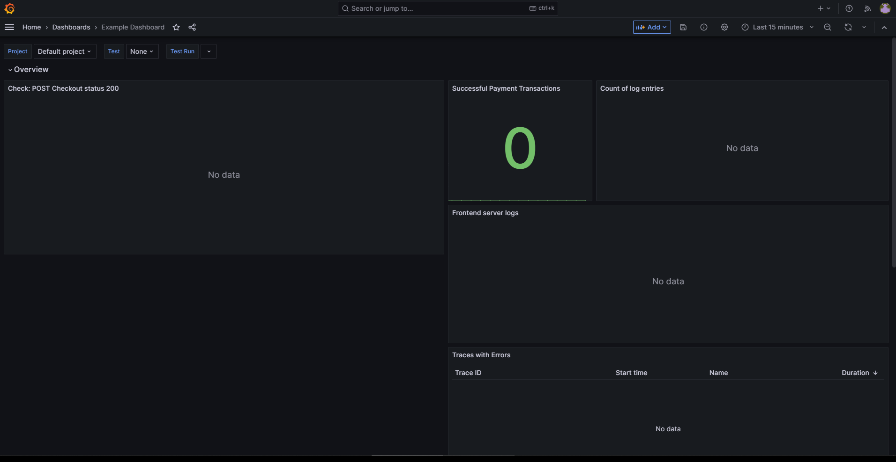
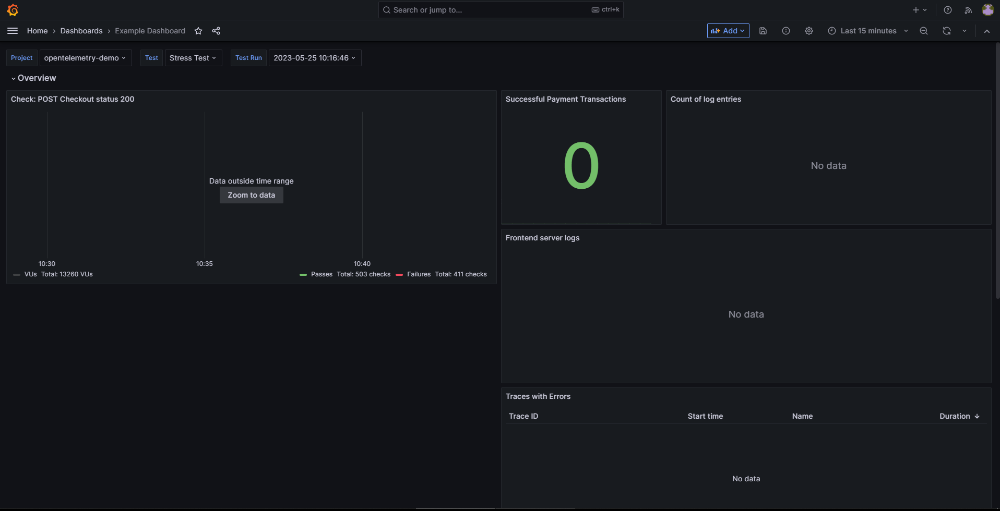
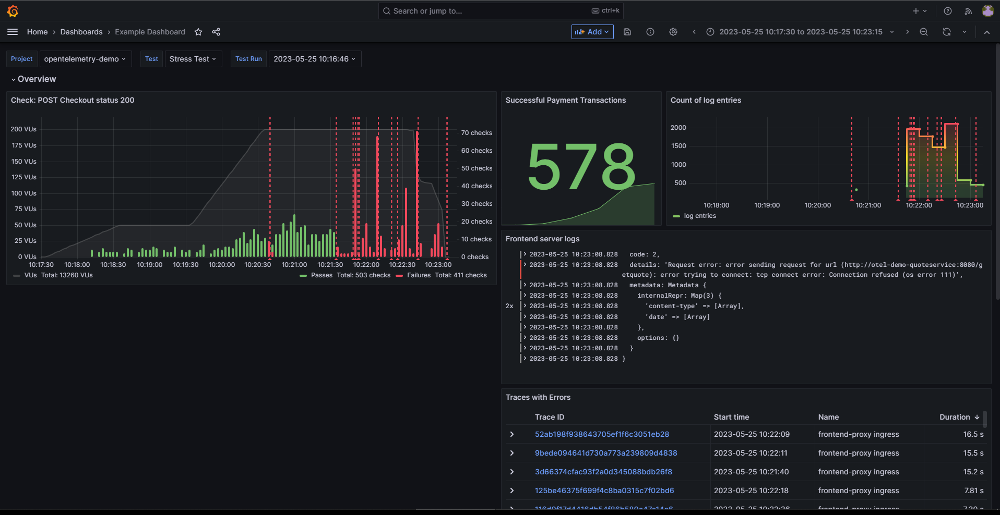
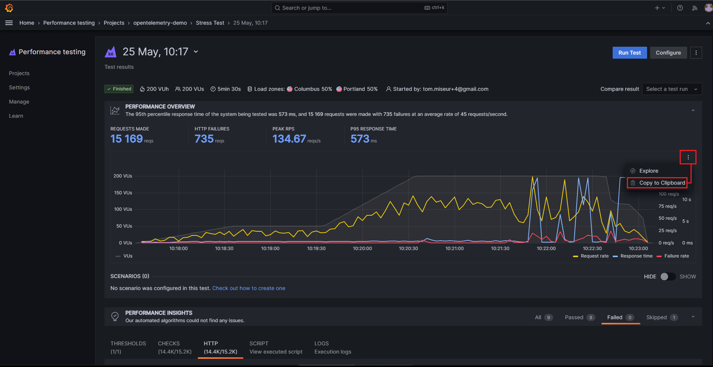
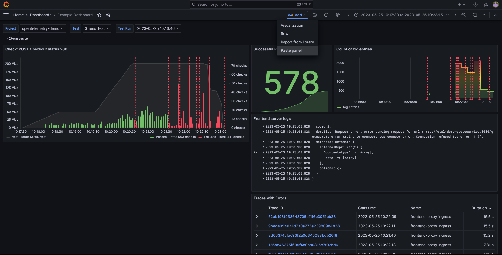
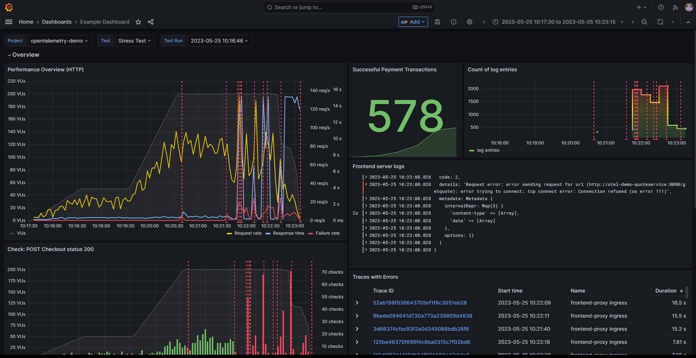
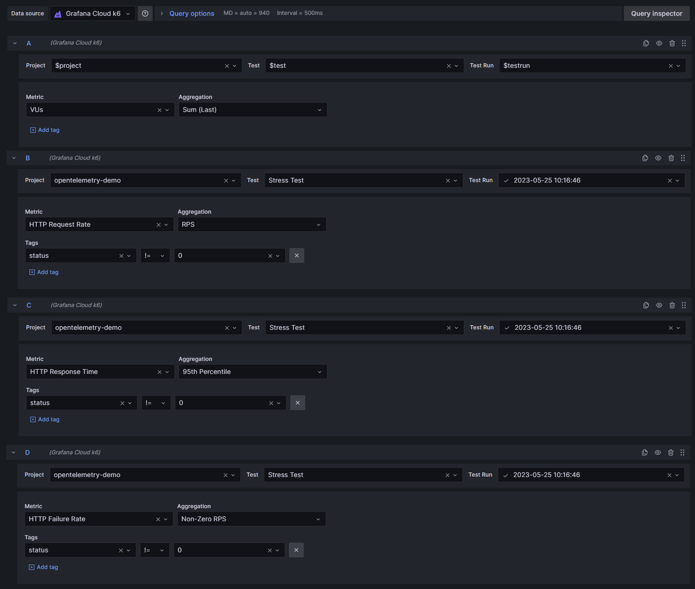
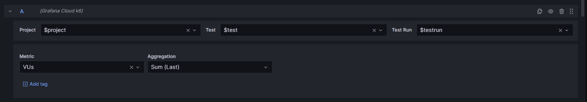
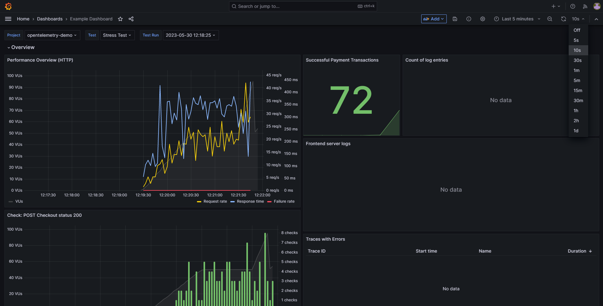

## Breakout 3: Construyendo un dashboard correlacionado

Este breakout explorará el dashboard que viene preconfigurado en tu Grafana Cloud. Es el mismo dashboard que se usó en la presentación, pero con un panel faltante - eso es lo que construiremos durante el breakout.

### 1: Encontrando el dashboard

El dashboard que buscamos se puede encontrar en `Dashboards` -> `General` -> `Example Dashboard`. Debería verse algo así:

La razón por la que aparece vacío al cargarlo por primera vez es porque no tenemos configurada una ejecución de prueba (test run). Para configurar una, selecciona una prueba usando los menús desplegables de Dashboard Variables hacia la parte superior de la pantalla. Las pruebas que has estado ejecutando en breakouts anteriores deberían estar disponibles para seleccionar.

Selecciona una prueba estableciendo `Project` en `opentelemetry-demo`, `Test` en `Stress Test`, y finalmente un `Test Run` (probablemente lo mejor sea elegir la ejecución de prueba más reciente).

Al hacerlo, es probable que los datos de la ejecución de prueba no sean visibles en el rango de tiempo actualmente seleccionado de `Last 15 minutes`. Como resultado, deberías ver un mensaje `Data outside time range` junto con un botón `Zoom to data` en el panel `Check: POST Checkout status 200`:

Haz clic en este botón para que Grafana actualice el rango de tiempo para que coincida con el rango de tiempo de la ejecución de prueba. Esto debería hacer que todos los paneles se actualicen con los datos de la ejecución de prueba:

Hay un espacio vacío en este dashboard que queremos llenar con un nuevo panel. La forma obvia de agregar un panel sería con la funcionalidad `Add new panel`, pero en lugar de hacer eso, copiaremos un panel desde la app de Grafana Cloud k6 y lo modificaremos para adaptarlo a nuestras necesidades.

### 2: Copiando paneles desde Grafana Cloud k6

Abre una nueva pestaña del navegador (ya que querremos volver al dashboard). En esta nueva pestaña, navega a Grafana Cloud k6 y localiza la misma ejecución de prueba que se acaba de seleccionar usando las Dashboard Variables. Querrás navegar hasta los resultados de la prueba de esa ejecución.

Una vez ahí, localiza el "ícono de hamburguesa" hacia la parte superior derecha de la serie temporal `Performance Overview`, y selecciona `Copy to Clipboard`:

En este punto, tenemos el JSON del panel en nuestro portapapeles, lo que significa que podemos pegarlo en el `Example Dashboard`. Vuelve a la pestaña anterior y selecciona el botón `Add` junto al selector de rango de tiempo. Ahora debería haber una entrada en el menú desplegable para `Paste panel`:

Selecciona esta opción para pegar el panel en el dashboard. Una vez que esté en el dashboard, querremos ajustar su tamaño para que se adapte al espacio vacío en el dashboard. El panel también debería existir en la fila `Overview`. Simplemente arrastra el panel hacia abajo, dentro de la sección `Overview`, y luego expándelo hacia abajo para llenar el espacio vacío. El resultado final debería verse así:

### 3: Modificando las consultas del panel

Lo importante a notar aquí es que el panel copiado estará codificado (hard-coded) a la ejecución de prueba de la que proviene. Dado que este dashboard ya se ha configurado con Dashboard Variables para permitirnos ver los resultados de *cualquier* ejecución de prueba, necesitaremos actualizar las consultas del panel para que también usen las variables.

Pasa el cursor sobre el panel para revelar el ícono de hamburguesa, luego selecciona `Edit`. Al hacerlo, se revela que este panel está compuesto por 4 consultas a la fuente de datos `Grafana Cloud k6`. Las consultas nos devuelven:

- VUs: el número total de VUs que se están ejecutando en cualquier momento dado durante la prueba
- HTTP Request Rate: el número de solicitudes HTTP que hicieron los VUs, agregadas por segundo. Además, hay un filtro aplicado a esta consulta para contar solo las solicitudes en las que el `Tag` `status` no fuera `0`. Esto significa que solo contaremos las solicitudes que recibieron algún tipo de respuesta (en otras palabras, los timeouts no estarían incluidos en esta métrica).
- HTTP Response Time: el tiempo de respuesta de las solicitudes HTTP, agregado por el `Percentil 95`. Igual que la consulta anterior, esta consulta también tiene un filtro aplicado para incluir solo las solicitudes en las que el `Tag` `status` no fuera `0`.
- HTTP Failure Rate: aquí, estamos obteniendo el número de solicitudes HTTP que fallaron, nuevamente filtrando para incluir solo las solicitudes en las que el `Tag` `status` fuera `0`.

Para que estas consultas usen las Dashboard Variables del dashboard, todo lo que necesitaremos hacer es modificar los menús desplegables `Project`, `Test` y `Test Run` para cada una de las consultas (12 actualizaciones en total) y hacer que apunten a los valores de la variable `$...` correspondiente.

Las consultas deberían terminar viéndose así:

La visualización del panel en realidad no debería cambiar si las Dashboard Variables se establecieran en la misma ejecución de prueba desde la que se copió el panel. Sin embargo, si ahora cambiaras las Dashboard Variables a una ejecución de prueba diferente, deberías ver que el panel se actualiza para reflejar los datos de la nueva ejecución de prueba. Con este pequeño cambio, ¡ahora hemos hecho que el panel sea dinámico, permitiéndonos ver los resultados de cualquier ejecución de prueba que queramos!

En este punto, es una buena idea `Save` (guardar) el dashboard, así que adelante, haz clic en el ícono de disquete y presiona `Save`.

### 4: Visualizando una prueba en ejecución

Además de proporcionarnos información histórica al mirar ejecuciones de pruebas anteriores, el dashboard también se puede usar para ver los resultados de una ejecución de prueba que se está ejecutando actualmente.

Para hacerlo, vuelve a la pestaña de Grafana Cloud k6 desde donde se copió el panel `Performance Overview`. Presiona el botón `Run Test` para iniciar otra ejecución de prueba.

En cuanto la ejecución de la prueba haya comenzado a inicializarse, vuelve a la pestaña del dashboard. El dashboard deberá actualizarse para que la nueva ejecución de prueba aparezca en la lista de `Test Runs` para seleccionar. Selecciona el `Test Run` y luego actualiza el selector de rango de tiempo a `Last 5 minutes`. También querrás configurar el dashboard para que se actualice automáticamente; un valor de `10s` debería ser suficiente.

Al hacerlo, veremos las estadísticas de la ejecución de prueba a medida que van llegando:

### Para cerrar

En este punto, el breakout ha terminado, ¡así que siéntete libre de explorar el dashboard! Por ejemplo, echa un vistazo a las trazas (traces) que aparecen en el panel `Traces with Errors`. Quizás también podrías agregar un nuevo panel para alguna de las otras métricas disponibles en la fuente de datos `Grafana Cloud k6`, como la métrica `Group Duration`, que nos da los tiempos de respuesta para las distintas mediciones de `group` que está generando la prueba.
